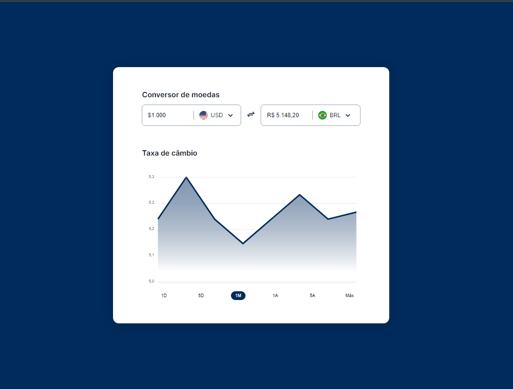
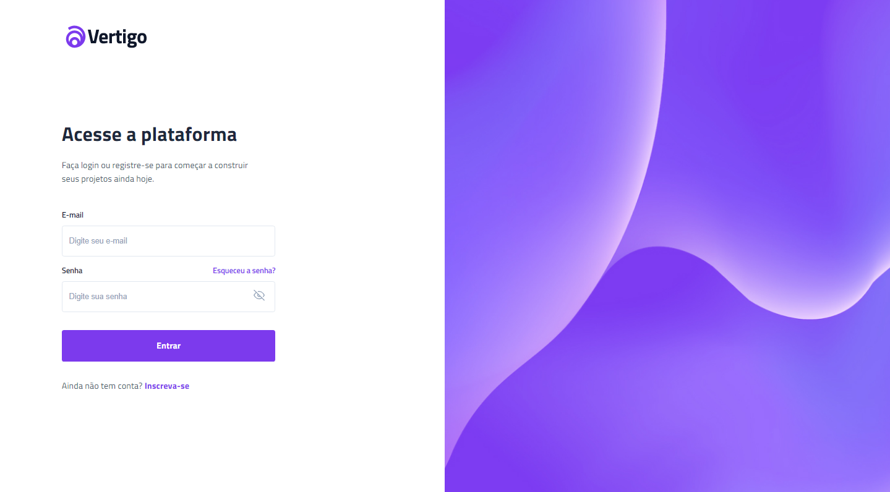

# #boraCodar

    Minha participação com os desafios semanais do #boraCodar da Rocketseat 
    <a href="https://www.rocketseat.com.br">Conheça mais sobre a Rocketseat aqui</a> 
     <table>
    <thead>
        <tr>
            <th align="center">
                 
                

                    <small>#</small>
                

            </th>
            <th align="center">
                 
                
 
                    <small>
                        NAME
                    </small>
                

            </th>
            <th align="left">
                
                
 
                    <small>
                    RELEASE DATE
                    </small>
                

            </th>
            <th align="center">
                
                
 
                    <small>
                    PREVIEW
                    </small>
                

            </th>
        </tr>
    </thead>
    <tbody>
        <tr>
            <td>01</td>
            <td><a href="01">Music Player</a></td>
            <td>07/04/23</td>
            <td align="center">
            </td>
        </tr>
        <tr>
            <td>02</td>
            <td><a href="02">Product Card</a></td>
            <td>07/04/23</td>
            <td align="center"></td>
        </tr>
        <tr>
            <td>03</td>
            <td><a href="03">Botões e Cursores</a></td>
            <td>07/04/23</td>
            <td align="center"></td>
        </tr>
        <tr>
            <td>04</td>
            <td><a href="04">Chat</a></td>
            <td>07/04/23</td>
            <td align="center"></td>
        </tr>
        <tr>
            <td>05</td>
            <td><a href="05">Calculadora</a></td>
            <td>07/04/23</td>
            <td align="center"></td>
        </tr>
        <tr>
            <td>06</td>
            <td><a href="06">Cartão de embarque</a></td>
            <td>07/04/23</td>
            <td align="center" ></td>
        </tr>
        <tr>
            <td>07</td>
            <td><a href="07">Encontre seu bloco no carnaval</a></td>
            <td>07/04/23</td>
            <td align="center" ></td>
        </tr>
        <tr>
            <td>08</td>
            <td><a href="08">Dashboard</a></td>
            <td>07/04/23</td>
            <td align="center" ></td>
        </tr>
        <tr>
            <td>09</td>
            <td><a href="09">Conversor de Moedas</a></td>
            <td>07/04/23</td>
            <td align="center" ></td>
        </tr>
        <tr>
            <td>10</td>
            <td><a href="10">Uma página de clima</a></td>
            <td>07/04/23</td>
            <td align="center" ></td>
        </tr>
        <tr>
            <td>11</td>
            <td><a href="11">Uma página de login</a></td>
            <td>07/04/23</td>
            <td align="center" ></td>
        </tr>
        <tr>
            <td>12</td>
            <td><a href="12">Um Kanban</a></td>
            <td>07/04/23</td>
            <td align="center" ></td>
        </tr>
    </tbody>
</table>

